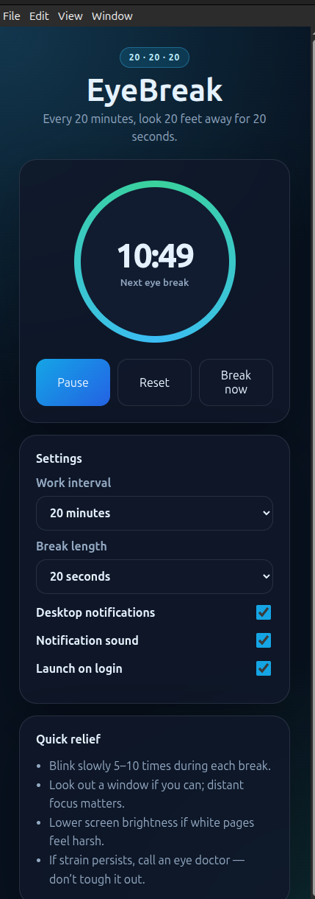

# EyeBreak

EyeBreak is a tiny cross-platform desktop app for the **20-20-20 eye rule**: every 20 minutes, look at something about 20 feet away for 20 seconds.

It runs quietly in the tray/menu bar and reminds you to rest your eyes without needing a browser tab open.



## Features

- 20-minute eye break reminders
- Always-on-top 20-second break window
- Desktop notifications
- Distinct start-break and break-complete sounds
- Start, pause, reset, and "break now"
- Configurable work interval and break length
- Tray/menu bar app so it can run in the background
- Optional launch on login
- Settings persistence
- Simple eye-strain relief tips

## Download

Download the latest release from the [GitHub Releases page](https://github.com/bradtraversy/eye-break/releases).

Available builds:

- **Windows:** `.exe` installer
- **macOS:** universal `.dmg` and `.zip`
- **Linux:** `.AppImage` and `.deb`

> Windows and macOS builds are currently unsigned, so SmartScreen or Gatekeeper may warn before opening.

## Run from source

Requirements:

- Node.js 22+
- npm

```bash
git clone https://github.com/bradtraversy/eye-break.git
cd eye-break
npm install
npm start
```

## Build locally

Build output is written to `dist/`.

```bash
npm run package:linux # Linux: AppImage + .deb
npm run package:win   # Windows: NSIS .exe installer
npm run package:mac   # macOS: universal .dmg + .zip
```

For best results, build each target on its native OS:

- Build Linux installers on Linux
- Build Windows installers on Windows
- Build macOS installers on macOS

Cross-building desktop installers is possible in some cases, but native CI is more reliable.

## Ubuntu desktop launcher during development

After building the Linux app locally, you can install a desktop/app-menu launcher:

```bash
npm run package:linux
npm run install:linux-desktop
```

This creates:

- `~/Desktop/EyeBreak.desktop`
- `~/.local/share/applications/eyebreak.desktop`

## Release workflow

The release workflow lives at `.github/workflows/release.yml`.

To create a release:

```bash
git tag v1.0.7
git push origin v1.0.7
```

GitHub Actions builds Linux, Windows, and macOS artifacts, uploads workflow artifacts, and attaches them to a draft GitHub Release.

## Development commands

```bash
npm run check              # JS syntax checks
npm run clean              # remove build output
npm run package:linux      # Linux installers
npm run package:win        # Windows installer
npm run package:mac        # macOS installers
npm run install:linux-desktop
```

## License

MIT
